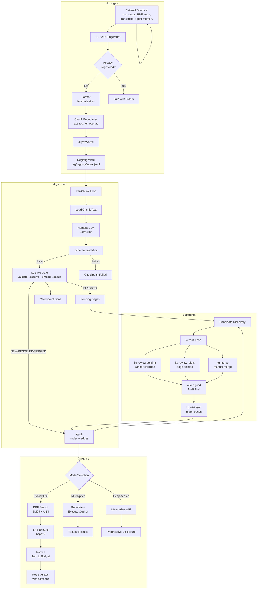
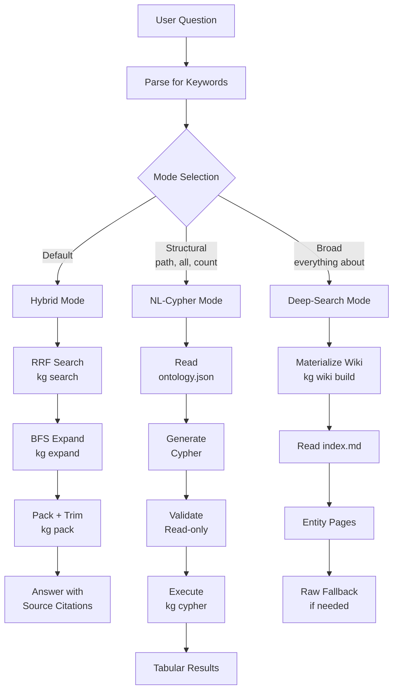
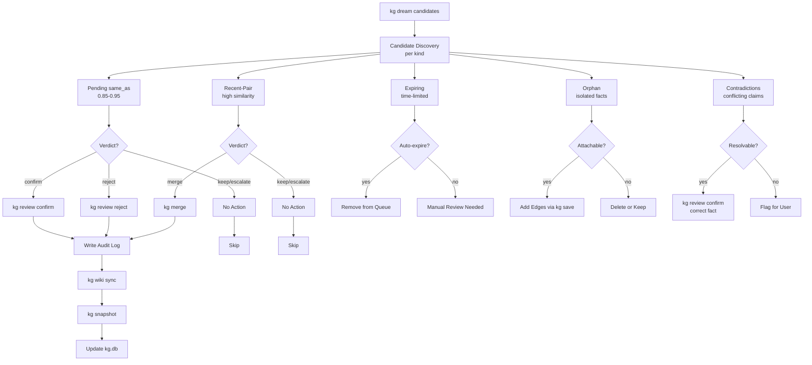
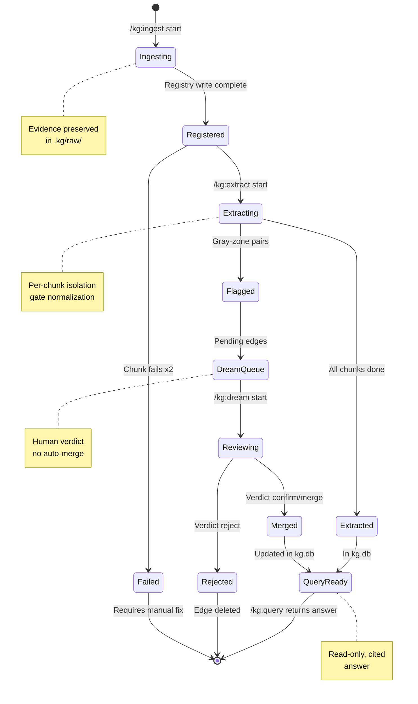

# /kg:* Data Flow Diagrams

## Full Pipeline



## Cross-System Integration

```mermaid
flowchart LR
    subgraph CodebaseMemory["codebase-memory-mcp"]
        CBM[Indexed Codebase]
        CBMQuery[Query Functions]
    end

    subgraph Graphify["Graphify"]
        GF[Transcripts]
        GFReindex[Re-index Mentions]
    end

    subgraph AgentMemory["AgentMemory"]
        AM[Session Observations]
        AMRecall[Recall Memory]
    end

    subgraph KG["Knowledge Graph"]
        Ingest[/kg:ingest]
        Extract[/kg:extract]
        Query[/kg:query]
        Dream[/kg:dream]
        DB[kg.db]
    end

    subgraph Wiki["wiki"]
        Pages[Entity Pages]
        Sync[kg wiki sync]
    end

    Ingest -->|Route code sources| CBMQuery
    CBM -->|Extract entities| Extract
    Extract --> DB

    Ingest -->|Route transcripts| GF
    GF -->|Extract nodes| Extract

    Ingest -->|Route agent-memory| AMRecall
    AM -->|Extract observations| Extract

    Query -->|Query functions| CBMQuery
    CBMQuery --> Query

    Query -->|Query conversations| GF
    GF --> Query

    Query -->|Query sessions| AMRecall
    AMRecall --> Query

    Dream -->|Update refs| CBMQuery
    Dream -->|Re-index| GFReindex
    Dream -->|Delete obs| AM

    DB --> Sync
    Sync --> Pages
    Pages --> Query
```

## Query Mode Routing



## Dream Candidate Processing



## State Lifecycle



## Command Call Graph

```mermaid
flowchart TD
    CLI[User CLI] --> Ingest[kg ingest]
    CLI --> Extract[kg extract]
    CLI --> Query[kg query / search / expand / pack]
    CLI --> Dream[kg dream candidates / merge / review]

    Ingest --> Markitdown[markitdown CLI]
    Ingest --> RegWrite[kg registry append]
    Ingest --> ChunkFrontmatter[Add frontmatter to .md]

    Extract --> RawStatus[kg raw status]
    Extract --> LLMPrompt[Harness LLM]
    Extract --> ValidateSchema[JSON schema validate]
    Extract --> Save[kg save]
    Extract --> Checkpoint[kg raw checkpoint]
    Extract --> WikiSync[kg wiki sync]

    Save --> Gate[Gate.normalize]
    Gate --> Resolve[Name resolution]
    Gate --> Embed[Embedding]
    Gate --> Dedup[Deduplication]

    Query --> Search[kg search]
    Search --> FTS5[FTS5/BM25]
    Search --> ANN[sqlite-vec ANN]
    Search --> RRF[RRF Fusion]

    Query --> Expand[kg expand]
    Expand --> BFS[Bidirectional BFS CTE]

    Query --> Pack[kg pack]
    Pack --> Rank[Rank: RRF+degree+recency]
    Pack --> Trim[Trim to budget]

    Query --> Cypher[kg cypher]
    Cypher --> ASTValidate[AST validate]
    Cypher --> ExecCypher[Execute read-only]

    Dream --> Candidates[kg dream candidates]
    Candidates --> SQLQueries[Per-kind SQL queries]

    Dream --> ReviewConfirm[kg review confirm]
    Dream --> ReviewReject[kg review reject]
    Dream --> Merge[kg merge]

    ReviewConfirm --> TxCommit[Transaction commit]
    ReviewReject --> TxCommit
    Merge --> TxCommit

    TxCommit --> AuditWrite[wiki/log.md append]
    TxCommit --> WikiRegen[kg wiki sync]
    TxCommit --> SnapshotWrite[kg snapshot]
```


